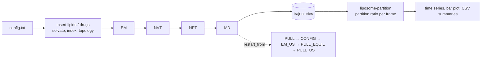

# liposome-pipeline

Automated construction, equilibration and analysis of drug-loaded **Martini 3** liposomes with
[GROMACS](https://www.gromacs.org/).

The package has two parts:

1. **`liposome-build`** turns a short text description of a lipid/drug/ion mixture into a solvated
   coarse-grained system and runs a configurable ladder of GROMACS stages (minimisation,
   equilibration, production, and an optional SLURM-driven umbrella-sampling workflow).
2. **`liposome-partition`** analyses finished trajectories and reports how strongly each drug
   partitions into the vesicle relative to bulk solvent, with a layout built for SLURM job arrays.



## Installation

Requires Python ≥ 3.9 and a GROMACS installation (`gmx`) on `PATH`.

```bash
git clone <this repository>
cd liposome-pipeline
python -m pip install -e ".[dev]"
```

Building systems needs only the Python standard library; MDAnalysis, NumPy, pandas and matplotlib
are used by the analysis commands and by the umbrella-sampling helpers.

## Quick start

```bash
liposome-build check examples/quickstart.txt            # validate and print the plan
liposome-build run   examples/quickstart.txt --overwrite --ntmpi 1
```

This builds a 60 DOPC + 20 cholesterol box, solvates it with Martini water and energy-minimises it.
Output lands in `runs/quickstart/`:

```
setup/    topol.top, index.ndx, solvated.gro, staged force field and molecules
EM/       EM.mdp, EM.tpr, EM.gro, ...
```

`examples/drug_loaded_liposome.txt` is a production-style recipe (DOPC/PEL/CHEMS, DEXT, ions,
EM → NVT → NPT → MD) and `examples/umbrella_sampling.txt` shows the SLURM umbrella workflow.
See [docs/configuration.md](docs/configuration.md) for every option.

Useful run flags: `--gmx PATH`, `--launcher srun`, `--ntomp N`, `--ntmpi N`, `--nb gpu`,
`--pme gpu`, `--bonded gpu`, `--pin on|off`. Use `--ntmpi 1` for very small test boxes, where
GROMACS cannot decompose the domain.

## Partition-ratio analysis

Trajectories are expected in directories named `<composition>_<T>[_Loaded<drug>]/<replicate>/`,
for example `52_47_1_298_LoadedIBU/rep1/`, containing `aligned_centered.gro` and
`MD_CENTERED_NOJUMP.xtc`. Drugs `DEXT`, `IBU` and `nfd` are recognised.

For each frame the vesicle radius is taken as the 90th percentile of lipid distances from the lipid
centre; drugs inside that radius count as encapsulated, and

```
partition ratio = (N_in / V_vesicle) / (N_out / (V_box − V_vesicle)),   V_vesicle = 4/3 π r³
```

```bash
liposome-partition run data/ --box-nm 35 --output-dir results      # everything, serially
```

On a cluster, one array task per system followed by an aggregation job:

```bash
GMX_SETUP=/path/to/GMXRC ROOTS="data" slurm/submit_partition.sh --partition=<your-partition>
```

Outputs (`--output-dir`): `partition_ratio_timeseries.{pdf,csv}`, `partition_ratio_bar.pdf`,
`partition_ratio_summary.csv` (per replicate) and `partition_ratio_grouped.csv` (mean ± SD across
replicates, averaged over the last `--tail-fraction` of each trajectory, default 0.75).
The cubic box edge is an input (`--box-nm`, default 35 nm) because the bulk volume depends on it.

## Running on SLURM

`slurm/build.sbatch` wraps `liposome-build run`; site-specific settings stay on the command line
or in `GMX_SETUP`:

```bash
GMX_SETUP=/path/to/GMXRC sbatch --partition=gpu slurm/build.sbatch config.txt
slurm/submit_builds.sh configs/ --partition=gpu     # one job per *.txt file
```

Umbrella-sampling stages submit their own jobs using the `slurm` block of the configuration file.
That workflow depends on a cluster and is covered by unit tests of its geometry and script
generation, not by an end-to-end test.

## Repository layout

```
src/liposome_pipeline/
    config.py  system.py  stages.py  pipeline.py  cli.py     build pipeline
    gromacs.py index.py   mdp.py     umbrella.py  slurm.py   GROMACS, index groups, MDP, SLURM
    data/mdp/                                                bundled Martini MDP templates
    analysis/                                                partition-ratio analysis
input/            Martini 3 force field, lipid/drug/ion topologies and structures
examples/         ready-to-run configuration files
slurm/            batch scripts for builds and analysis
tests/            pytest suite
docs/             configuration reference
```

## Testing

```bash
pytest
```

Analysis tests use a synthetic vesicle with a known analytical partition ratio. The pipeline
tests run real GROMACS builds and are skipped automatically when `gmx` is not installed.

## Data and force field

`input/` contains Martini 3.0.0 force-field files
(Souza *et al.*, Nat. Methods 18, 382–388, 2021, DOI 10.1038/s41592-021-01098-3) and the molecule
definitions used by the examples. Check the licence terms of the individual parameter files before
redistributing them.

## License

MIT, see [LICENSE](LICENSE).
